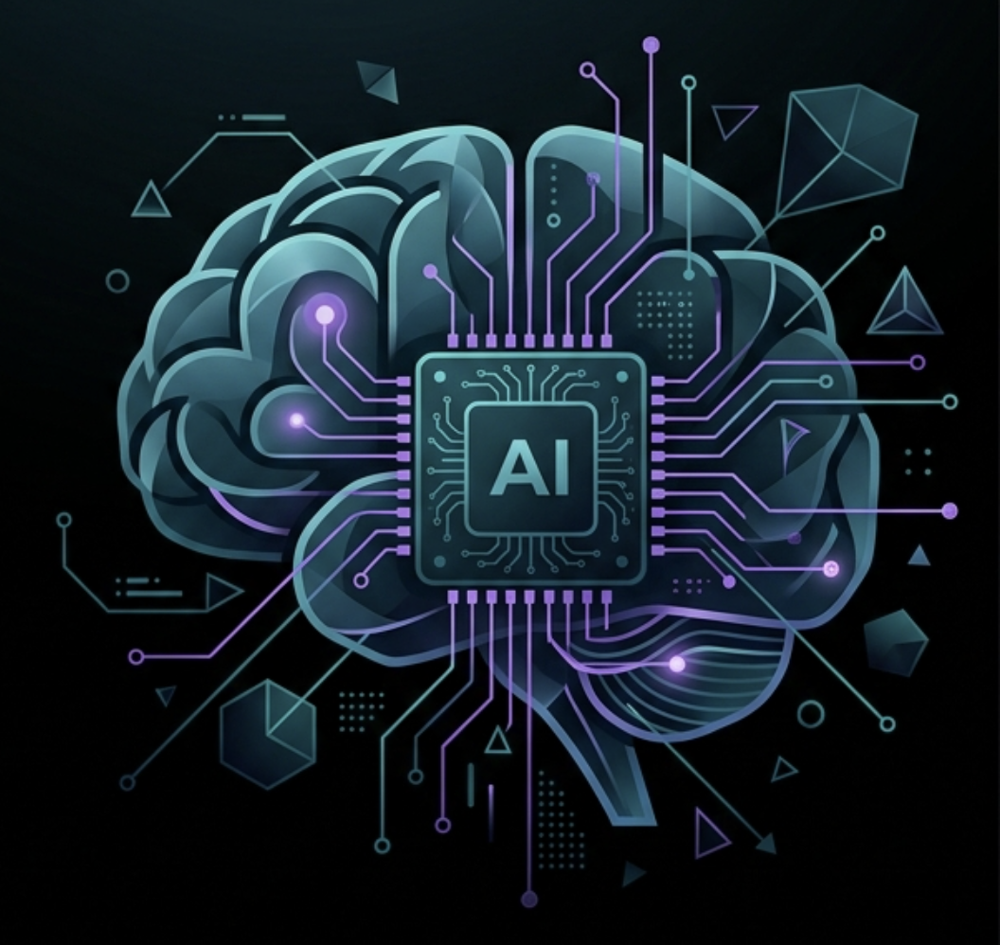

<div align="center">



# AI Team System

[](LICENSE)
[](https://claude.ai/code)
[](#what-you-get-on-day-1)
[](https://github.com/kennethsolomon/ai-team-system)

*Built to delegate.*

</div>

> Stop prompting one AI for everything. Get a team.

Instead of wrestling with a single assistant that forgets everything between sessions, AI Team System gives you **11 specialists** -- each with a clear role, persistent memory, and zero overlap. You talk to John (your Chief of Staff). John handles the rest.

---

## See it in action

<div align="center">
<br/>
<a href="https://kennethsolomon.github.io/ai-team-system/demo/demo-video.html">

</a>
<br/><br/>
<sub>Animated HTML demo -- <a href="https://kennethsolomon.github.io/ai-team-system/demo/demo-video.html">click to watch live</a> or clone and open <code>demo/demo-video.html</code> locally.</sub>
<br/><br/>
</div>

---

## Table of contents

- [Why this exists](#why-this-exists)
- [What you get on day 1](#what-you-get-on-day-1)
- [Quickstart](#quickstart)
- [How it works](#how-it-works)
- [Adding tools (optional)](#adding-tools-optional)
- [Obsidian integration (optional)](#obsidian-integration-optional)
- [Project layout](#project-layout)
- [A typical session](#a-typical-session)
- [Who this is for](#who-this-is-for)
- [Contributing](#contributing)
- [License](#license)
- [Acknowledgments](#acknowledgments)

---

## Why this exists

Single-AI setups break down fast -- context drifts, tasks bleed into each other, and nobody owns anything. AI Team System fixes this with **role separation**: each agent owns one domain, remembers what it learned, and never steps on another agent's work. The result is a compounding knowledge system that gets sharper every time you use it.

---

## What you get on day 1

No accounts. No MCPs. No setup beyond `git clone` and `python3 db/migrate.py`.

These 8 agents work immediately:

| | Name | What they do |
|---|---|---|
| | **John** | Chief of Staff. Routes every request to the right specialist. Never does work himself. |
| | **Pax** | Research Analyst. Studies real experts in any domain before the team hires a new specialist. |
| | **Mike** | HR Director. Takes Pax's research and builds a fully-defined AI team member. |
| | **Vault** | Data Architect. Owns the SQLite database, ingestion pipelines, and full-text search. |
| | **Atlas** | Knowledge Architect. Designs your folder structure, tagging system, and naming conventions. |
| | **Sage** | Curriculum Designer. Builds self-paced learning paths for any topic, fully resourced. |
| | **Lux** | Full-Stack Developer. Builds the web dashboard -- FastAPI + React + dark theme. |
| | **Vex** | Verification Specialist. Adversarially reviews every implementation before you see it. |

These 3 agents get better when you connect external tools (but work in limited mode without them):

| | Name | What they do | What they need |
|---|---|---|---|
| | **Koda** | Productivity Manager. Captures tasks, runs daily briefings, keeps your list honest. | A task manager (Gawin, Todoist, etc.) -- or just manages local markdown files |
| | **Sol** | Wellness Coach. Reads your journal and surfaces mood, sleep, and energy patterns. | A journal app -- or reads local `.md` diary files directly |
| | **Kai** | Morning Briefing. Synthesizes calendar, tasks, finances, and news into a daily digest. | Calendar / finance MCPs for the full experience; works without them using local files + web news |

---

## Quickstart

**Prerequisites:** [Claude Code](https://claude.ai/code) (CLI or desktop) and Python 3.11+

```bash
git clone https://github.com/kennethsolomon/ai-team-system my-ai-team
cd my-ai-team
claude .
```

Then inside Claude Code:

```
/setup
```

John walks you through the rest in about 5 minutes.

---

## How it works

**You only ever talk to John.**

```
You -> John -> the right specialist -> Owner's Inbox/
```

Drop a file in `Team Inbox/`, ask a question, or give a task. John figures out who should handle it, hands it off, and delivers the result. You never run scripts or manage agents manually.

**The team remembers.**

Every session, agents load memories from the previous one -- preferences, lessons learned, past decisions. The knowledge compounds over time.

**The team grows.**

Need a finance advisor? A fitness coach? A content writer?

```
"I need someone who can handle [domain]."
```

John runs a two-step pipeline: Pax researches the domain, Mike creates the agent. The new hire is available immediately and in every future session.

---

## Adding tools (optional)

The core system works with zero external integrations. When you're ready, you can connect MCP tools to unlock more:

| Tool | Unlocks |
|------|---------|
| Any task manager (Gawin, Todoist, etc.) | Koda pulls live tasks instead of reading markdown files |
| Google Calendar | Kai adds your real schedule to the morning briefing |
| A journal app (Forever Diary, etc.) | Sol and Kai pull from your actual diary |
| A finance tracker | Kai adds a financial pulse to the daily briefing |

To add an MCP: install it in Claude Code, then tell John -- he'll update the relevant agent's configuration.

---

## Obsidian integration (optional)

If you use Obsidian, add your vault path to `config/config.json`:

```json
{
  "owner_name": "Your Name",
  "vault_paths": {
    "MyVault": "/path/to/your/obsidian/vault"
  }
}
```

Then run the ingestion pipeline:

```bash
python3 db/pipeline/ingest_obsidian.py
```

This indexes your entire vault into `brain.db` with full-text search. Safe to re-run -- only processes changed files.

---

## Project layout

```
CLAUDE.md                    <- John's routing rules and workflow protocol
README.md

.claude/
├── agents/                  <- 11 agent definitions (the executable configs)
├── settings.json
└── skills/
    ├── setup/               <- /setup onboarding flow
    ├── hire-specialist/     <- /hire-specialist pipeline (Pax -> Mike)
    └── obsidian-markdown.md <- Obsidian syntax reference for all agents

Team/
├── roster.md                <- Master list of active team members
├── soul.md                  <- Shared values every team member inherits
└── *.md                     <- Identity profile for each team member

db/
├── schema.sql               <- SQLite schema (FTS5, memory, embeddings)
├── migrate.py               <- Run once to initialize brain.db
├── pipeline/
│   └── ingest_obsidian.py   <- Walks your vault, indexes into brain.db
└── query/
    └── memory.py            <- add_memory, add_lesson, load_context_for_session

Areas/
├── Owner/                   <- Your profile and goals (fill in during /setup)
├── Daily/                   <- Morning briefings (HTML)
├── Learning/                <- Learning paths from Sage
└── Finance/                 <- Financial snapshots

Owner's Inbox/               <- Finished deliverables land here
├── Hiring/
├── Reports/
├── Research/
├── Summaries/
└── Verification/

Team Inbox/                  <- Drop files here for the team to process

config/
├── config.example.json      <- Copy -> config.json, add your vault paths
└── .env.example             <- Copy -> .env, add API keys if needed

demo/
└── demo-video.html          <- Animated product walkthrough

assets/
└── logo.svg
```

---

## A typical session

1. Open the project in Claude Code
2. John starts up automatically -- checks the inbox, loads memory from last session
3. Tell John what you need
4. John delegates -- result appears in `Owner's Inbox/`
5. Say "bye" -- John saves a session summary for tomorrow

---

## Who this is for

You'll get the most out of this if you:

- Use Claude Code (CLI or desktop) and want a structured, long-running AI system
- Work across multiple sessions and want context to persist
- Like the idea of a team with clear ownership rather than one assistant doing everything
- Use Obsidian or markdown files for notes (optional but unlocks more)
- Want to start simple and expand as your needs grow

---

## Contributing

Contributions welcome. See [CONTRIBUTING.md](CONTRIBUTING.md) for guidelines.

If this project helped you build something useful, a star on the repo goes a long way.

---

## License

[MIT](LICENSE) -- use it, fork it, build on it.

---

<div align="center">

Built by [Kenneth Solomon](https://github.com/kennethsolomon). Powered by [Claude Code](https://claude.ai/code).

</div>
